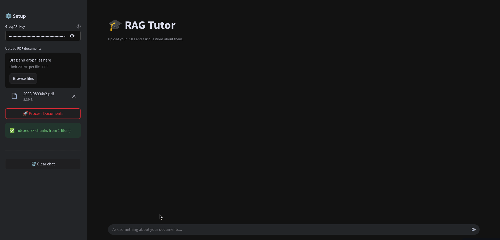
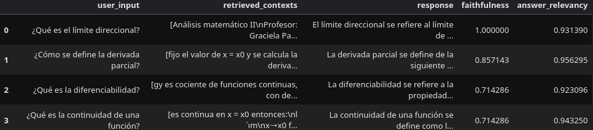

# RAG Tutor

An intelligent Q&A chatbot powered by Retrieval-Augmented Generation (RAG) that allows the user to upload their own documents and use them as a knowledge base to avoid hallucinations by grounding answer with the provided context.

## Demo
[**Try the live app**](https://rag-academic-tutor.streamlit.app/)



## Architecture

```
PDF Documents
     ↓
PyMuPDFLoader + text cleaning    # handles Spanish encoding & LaTeX
     ↓
RecursiveCharacterTextSplitter   # 1000 chars, 200 overlap
     ↓
multilingual-e5 (small/base/large)   # HuggingFace embeddings, CPU
     ↓
Qdrant Cloud               # vector store, cosine similarity
     ↓
LLaMA 3.3 70B via Groq API       # LLM generation
     ↓
Conversational RAG Chain         # LangChain + memory
```

## Evaluation (RAGAS)

Evaluated on 4 domain-specific questions using RAGAS framework, with a score of 0.82 in **Faithfulness** and 0.94 in **Answer Relevancy**



## Tech Stack

| Tool | Purpose |
|---|---|
| LangChain | Orchestration |
| HuggingFace `multilingual-e5` (small/base/large) | Embeddings |
| Streamlit | Frontend & deployment |
| Qdrant Cloud | Persistent vector storage |
| Groq API (LLaMA 3.3 70B) | LLM |
| RAGAS | RAG evaluation |
| PyMuPDF | PDF parsing |

## Known Limitations

- Mathematical formulas rendered as images in PDFs cannot be extracted as text — a fundamental constraint of text-based PDF parsing, solvable with specialized math OCR tools (e.g. MathPix)
- Qdrant runs in-memory — index is lost on session restart and must be rebuilt
- Evaluation questions are domain-specific — new document sets require new eval questions (Context Precision can't be tracked because of this)

 ---

## Roadmap

- [x] Streamlit frontend — drag & drop PDF upload + chat interface
- [x] Persistent Qdrant Cloud — no more session resets
- [ ] LangSmith tracing — debug and monitor every chain call
- [ ] CI/CD with GitHub Actions — auto-run RAGAS on every change

---

## What I Learned

- RAG pipeline design and tradeoffs (chunk size, overlap, k retrieval)
- Embedding model selector (small/base/large) with size/quality tradeoffs
- PDF encoding issues with LaTeX-generated documents and how to fix them
- RAG evaluation with RAGAS and what faithfulness vs answer relevancy measure
- Why more retrieved chunks (k) improves relevancy but can reduce faithfulness
- Multi-session isolation using UUID-based Qdrant Cloud collections

## 📝 Notes

- Vector index is scoped per session — re-upload required on page refresh

